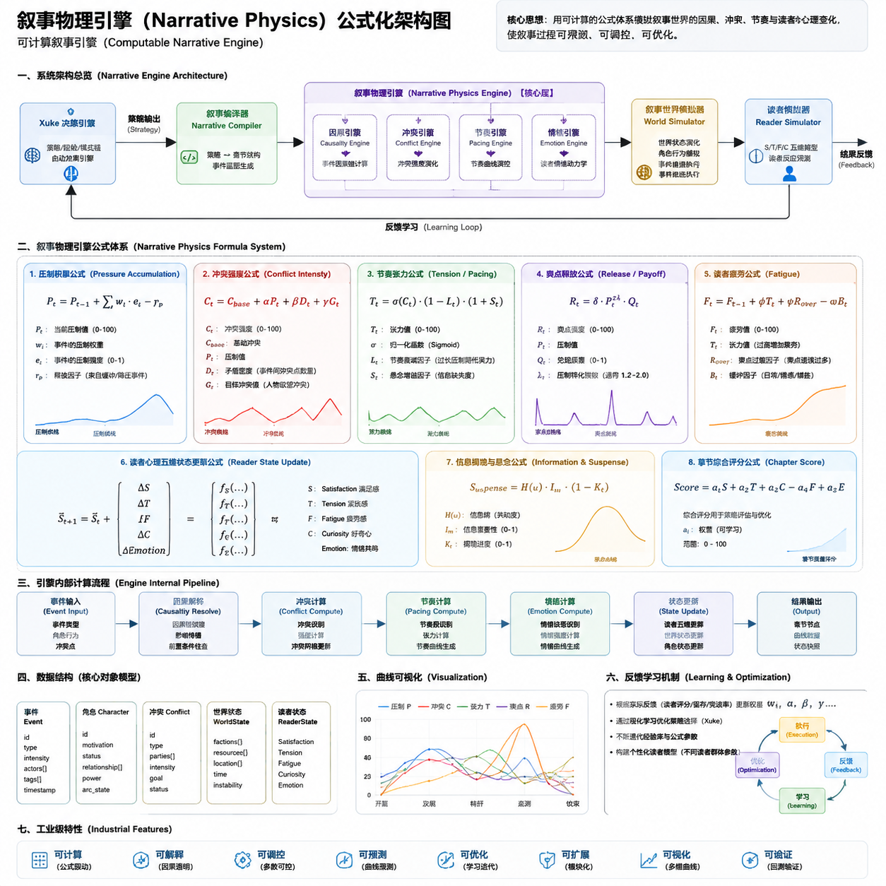

# 叙事物理引擎 · 公式化架构说明

> 与架构图 `叙事物理引擎架构图.png` 一一对应（§I–VII）

---

## 架构图



> 全系统总览见 `../../文档中心/双系统工业架构图.png`（图2）

---

## 一、系统架构总览（对应图 §I）

```text
Xuke 决策引擎
    ↓ 策略 / 经验 / 模式链
02 章节编译器（叙事编译器）
    ↓ 叙事结构 / 事件图
05 叙事物理引擎（核心层）
    ├─ 因果引擎
    ├─ 冲突引擎
    ├─ 节奏引擎
    └─ 情绪引擎
    ↓
03–04 世界模拟器 + 角色行为
    ↓
06 读者模拟器（五维 Q/H/T/S/F）
    ↓
09 快照 → 10 反馈回流 → Xuke 优化
```

**边界**：Xuke 只到「策略输出」；物理引擎及以下全部在 Chuangjie。

---

## 二、八大核心公式（对应图 §II）

| 序号 | 公式名 | 符号 | 规范章节 |
|------|--------|------|----------|
| 1 | 压制累积 | P_t | `叙事物理公式.md` §2.1 §2.6 |
| 2 | 冲突强度 | C_t | §2.3 |
| 3 | 张力/节奏 | T_t | §2.3 + §2.1（Sigmoid 见下） |
| 4 | 释放/爽点 | R_t / BI | §2.1 |
| 5 | 疲劳 | F_t | §3（读者疲劳） |
| 6 | 读者状态更新 | ΔQ/H/T/S/F | §3 + Xuke 衰减 |
| 7 | 信息/悬念 | X / Suspense | §2.2 |
| 8 | 章节评分 | Score | §5 + 快照 `成功得分` |

### 补充：节奏 Sigmoid（图 §II-3）

```
T_pace = σ(k × (C/100 − 0.5)) × 100 − 节奏瓶颈 − 悬念修正

σ(x) = 1 / (1 + e^(−x))，k 默认 6
节奏瓶颈 = 缓冲段不足 ? 15 : 0
悬念修正 = (X/100) × 10
```

### 补充：章节评分（图 §II-8）

```
Score = 0.25×Q + 0.20×H + 0.15×T + 0.25×S_eff + 0.15×(100−F)

S_eff = S × (1 − F/150)    # 与 Xuke 阅读体验指数一致
```

---

## 三、引擎内部流水线（对应图 §III）

```text
事件输入（类型/角色行为/爽点）
    → 因果解析（因果引擎）
    → 冲突计算（冲突引擎）
    → 节奏计算（节奏引擎）
    → 情绪计算（情绪引擎）
    → 状态更新（世界运行时 + 读者五维）
    → 输出（章节节点 / 曲线数据 / 状态快照）
```

详见：`引擎流水线.md`

---

## 四、核心对象模型（对应图 §IV）

Schema：`核心对象.schema.yaml`

| 对象 | 用途 |
|------|------|
| 事件 | 叙事物理最小输入单元 |
| 角色 | 行为代理 |
| 冲突 | 冲突引擎状态 |
| 世界状态 | 03 世界运行引擎 |
| 读者状态 | 06 读者模拟器（对齐 Xuke 五维） |

---

## 五、阶段曲线（对应图 §V）

典型卷级阶段与指标走势：

| 阶段 | P | C | T | SD/释放 | F |
|------|---|---|---|---------|---|
| 开篇 | 低↑ | 低↑ | 低↑ | 低 | 低 |
| 发展 | 中↑ | 中↑ | 中↑ | 累积 | 缓升 |
| 转折 | 高 | 高↑ | 高↑ | 蓄力 | 中 |
| 高潮 | 峰值 | 峰值 | 峰值 | 释放↓ | 降 |
| 收束 | 降 | 降 | 降 | 余韵 | 降 |

---

## 六、学习优化机制（对应图 §VI）

```text
执行（Chuangjie 仿真）
    → 反馈（偏差分 / 成功得分 / 快照）
    → 学习（Xuke 快照.学习信号）
    → 优化（α/β/γ/w 系数 + 经验权重）
```

Chuangjie **只上报**；Xuke **只决策如何调权重**。

---

## 七、工业级特征（对应图 §VII）

| 特征 | 实现 |
|------|------|
| 可计算 | 八大公式 + 系数 Schema |
| 可解释 | 因果链 + 事件→公式追溯 |
| 可控 | Xuke 策略 + 07 冲突推进器 |
| 可预测 | 06 读者模拟 + 曲线预测 |
| 可优化 | 10 反馈回流闭环 |
| 可扩展 | 四引擎模块化 |
| 可视化 | 架构图 + 运行时曲线 |
| 可验证 | 章节推演示例 + 偏差分 |

---

## 相关文件

| 文件 | 说明 |
|------|------|
| `叙事物理公式.md` | 公式全文 |
| `指标定义.schema.yaml` | 世界运行时六维 |
| `核心对象.schema.yaml` | 事件/角色/冲突/状态 |
| `引擎流水线.md` | 逐步处理流程 |
| `../文档中心/运行时架构图.md` | Mermaid 系统图 |
