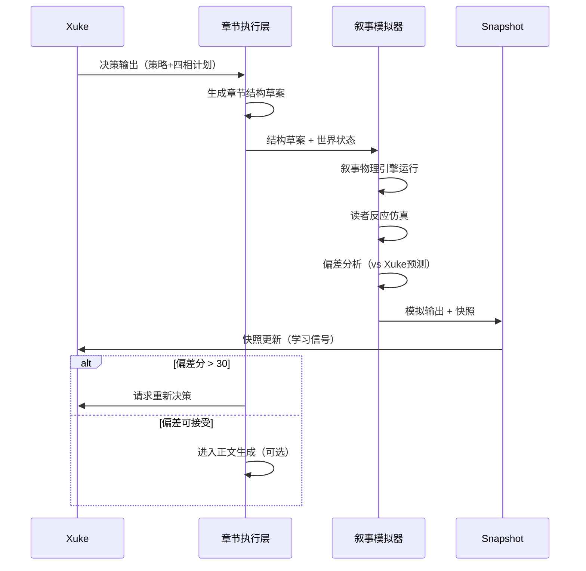

# 章节推演模拟器 · 架构图

> Chuangjie 核心模块 — 章级叙事物理 + 读者反应仿真

---

## 一、系统级架构

```text
                    ┌─────────────────────────────────┐
                    │            Xuke（脑）            │
                    │  经验库 · 冲突 · 权重 · 决策输出  │
                    └───────────────┬─────────────────┘
                                    │ 章节策略（YAML）
                                    ▼
┌───────────────────────────────────────────────────────────────────┐
│                        Chuangjie（世界运行器）                      │
│                                                                   │
│  ┌─────────────┐    ┌─────────────┐    ┌─────────────┐             │
│  │ 02_章节执行  │ → │ 05_Plot调度 │ → │ 03_角色系统 │             │
│  │ 策略→结构   │    │ 因果链编排  │    │ 行为展开    │             │
│  └──────┬──────┘    └──────┬──────┘    └──────┬──────┘             │
│         └──────────────────┼──────────────────┘                   │
│                            ▼                                      │
│              ┌─────────────────────────┐                          │
│              │   06_叙事模拟器          │                          │
│              │   ┌─────────────────┐   │                          │
│              │   │ 叙事物理引擎     │   │                          │
│              │   │ 因果·角色·Plot  │   │                          │
│              │   └────────┬────────┘   │                          │
│              │            ▼             │                          │
│              │   ┌─────────────────┐   │                          │
│              │   │ 读者反应仿真     │   │ ← 引用 Xuke 读者模型公式 │
│              │   │ Q/H/T/S/F 曲线  │   │                          │
│              │   └────────┬────────┘   │                          │
│              │            ▼             │                          │
│              │   ┌─────────────────┐   │                          │
│              │   │ 偏差分析         │   │                          │
│              │   │ 预测 vs 实测     │   │                          │
│              │   └─────────────────┘   │                          │
│              └────────────┬────────────┘                          │
│                           ▼                                       │
│              ┌─────────────────────────┐                          │
│              │   07_Snapshot快照        │                          │
│              └────────────┬────────────┘                          │
│                           │                                       │
│  ┌─────────────┐          │          ┌─────────────┐             │
│  │ 04_世界状态  │ ←────────┴────────→ │ 正文生成层   │（可选）      │
│  └─────────────┘                     └─────────────┘             │
└───────────────────────────────────────────────────────────────────┘
                                    │
                                    ▼ 快照更新
                    ┌─────────────────────────────────┐
                    │            Xuke（学习回流）       │
                    └─────────────────────────────────┘
```

---

## 二、单章推演时序



---

## 三、叙事物理引擎内部

```text
章节结构草案
    │
    ├─→ [因果链模块]  事件序列 → 触发关系图
    │
    ├─→ [角色模块]    各角色在本章的行为节点
    │
    ├─→ [Plot模块]    主线/支线在本章的交汇点
    │
    ├─→ [世界模块]    资源与力量平衡变化
    │
    └─→ [沉浸检测]    逻辑硬伤 / OOC / 注水 → 中断分
            │
            ▼
      仿真运行态（中间产物）
            │
            ▼
      读者反应仿真（Xuke 公式）
            │
            ▼
      模拟输出
```

---

## 四、模块职责速查

| 模块 | 路径 | 输入 | 输出 |
|------|------|------|------|
| 章节执行 | `02_章节执行层/` | Xuke 决策输出 | 章节结构草案 |
| Plot 调度 | `05_Plot调度/` | 结构草案 | 因果链 |
| 角色系统 | `03_角色系统/` | 因果链 | 行为节点 |
| 世界状态 | `04_世界状态/` | 行为结果 | 状态 delta |
| **叙事模拟器** | `06_叙事模拟器/` | 结构 + 世界态 | 读者曲线 + 偏差 |
| Snapshot | `07_Snapshot快照/` | 模拟输出 | 回流 Xuke |

---

## 五、关键设计原则

1. **先结构、后正文** — 模拟器只消费结构草案，不依赖成文
2. **先仿真、后写作** — 预演模式通过后再生成正文
3. **公式引用、不重复定义** — 读者模型归属 Xuke
4. **偏差驱动迭代** — 仿真与预测差距是系统变强的燃料
