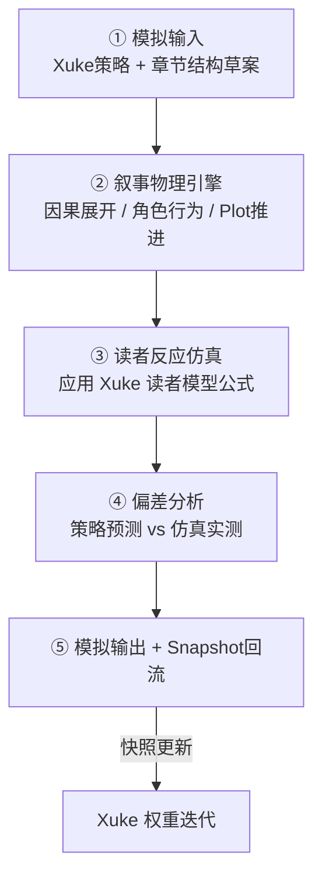

# 叙事模拟器 · 系统协议

> 版本：**1.0**  
> 归属：**Chuangjie `06_叙事模拟器`**（不属于 Xuke）

---

## 一、定位

```text
输入：已生成的章节结构草案（非正文）
处理：在叙事物理引擎中跑一遍因果链
输出：读者反应仿真曲线 + 执行偏差报告 + Snapshot
```

**回答的问题**：「如果按这个结构写，读者会发生什么？」

**不回答的问题**：「应该怎么写？」（那是 Xuke 决策系统）

---

## 二、模拟流水线（五步）



---

## 三、叙事物理引擎（Narrative Engine）

负责在**结构化章节**上运行「叙事物理规则」：

| 模块 | 职责 |
|------|------|
| 因果链展开 | 事件 A → 触发事件 B 的可追溯链 |
| 角色行为解析 | 角色在结构位上的行为是否符合人设约束 |
| Plot 推进 | 多线剧情在本章的交汇与偏移 |
| 世界状态更新 | 资源、阵营、力量平衡变化 |
| 沉浸中断检测 | 引用 Xuke `沉浸中断因子` 规则 |

**输出**：`仿真运行态`（中间态，非正文）

---

## 四、读者反应仿真

对仿真运行态，按 Xuke `04_读者模型/读者状态模型公式.md` 计算：

1. 识别本章触发的经验ID（从结构映射）
2. 叠加 `读者心理效果` 变化量
3. 应用自然衰减
4. 检查阈值告警
5. 与 Xuke `决策输出.读者曲线预测` 对比 → 偏差分

---

## 五、与 Xuke 决策预测的对比

```
偏差分 = Σ |仿真值 − 预测值| / 维度数

偏差分 < 15  → 策略准确，快照 success_score 高
偏差分 15–30 → 中等偏差，记录学习信号
偏差分 > 30  → 策略失效，标记失败模式候选
```

---

## 六、模板与示例

| 文件 | 说明 |
|------|------|
| `模板/01_模拟输入.schema.yaml` | 输入 Schema |
| `模板/02_仿真运行态.schema.yaml` | 引擎中间态 |
| `模板/03_模拟输出.schema.yaml` | 输出 Schema |
| `模板/示例/章节推演示例.yaml` | 完整填表 |

---

## 七、运行模式

| 模式 | 说明 |
|------|------|
| 预演模式 | 正文未写，仅结构草案 → 仿真 → 决定是否调整策略 |
| 复盘模式 | 正文已写 → 提取结构 → 仿真 → 对比实际反馈 |
| 联调模式 | 与 Xuke 决策接口端到端跑通 |

默认启动：**预演模式**
