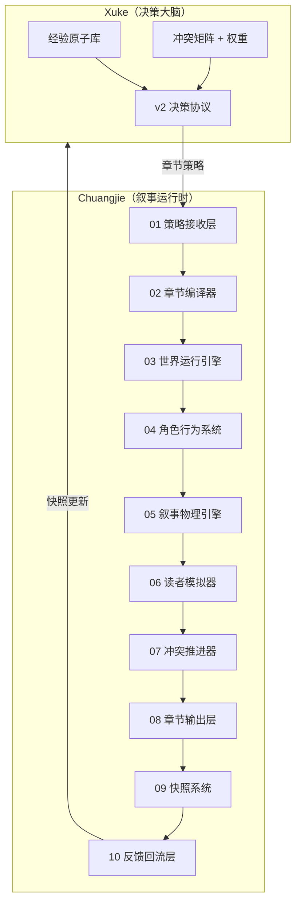
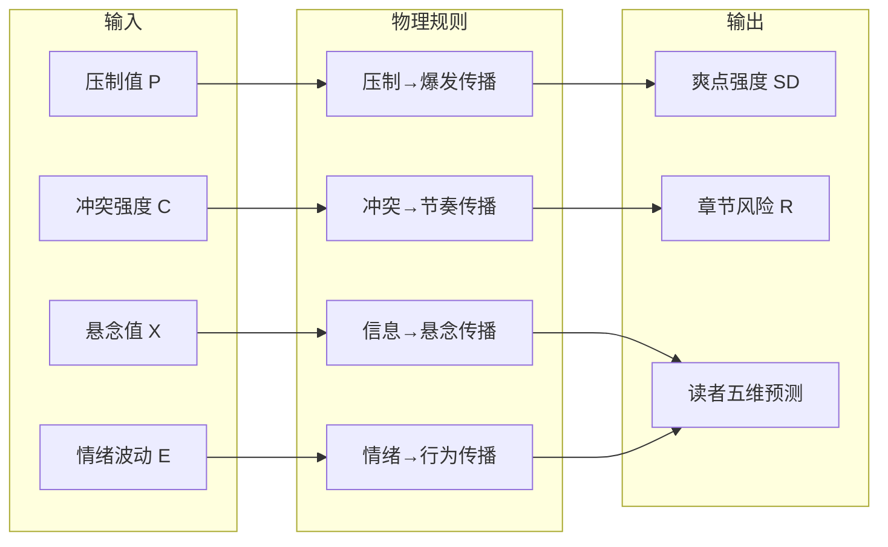
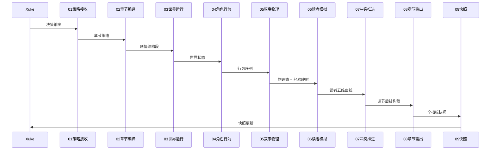

# 运行时架构图（公式化 · 工业级）

> Chuangjie v2.0 · Narrative Runtime Engine

---

## 一、系统级架构



---

## 二、叙事物理引擎内部



---

## 三、单章运行时序



---

## 四、工业闭环

```text
        Xuke
         ↓ 叙事策略
     Chuangjie
         ↓ 章节结构编译
      世界运行 + 角色行为
         ↓
    叙事物理引擎（P/C/X/E/SD/R）
         ↓
      读者模拟器（Q/H/T/S/F）
         ↓
      冲突推进器（节奏调节）
         ↓
      章节结构稿输出
         ↓
      Snapshot 全指标记录
         ↓
      反馈回流 Xuke（权重迭代）
```

---

## 五、模块 ↔ 公式映射

| 模块 | 读写指标 | 核心公式节 |
|------|----------|------------|
| 03 世界运行 | P, C, 世界不稳定度 | §2.1 §2.4 |
| 04 角色行为 | E, P | §2.5 |
| 05 叙事物理 | P, SD, X, C, E, R | §2 全部 |
| 06 读者模拟 | Q, H, T, S, F | §3 + Xuke 公式 |
| 07 冲突推进 | C, X, T, F | §4 |
| 09 快照 | 全指标 | §5 |

完整公式：`05_叙事物理引擎/叙事物理公式.md`

---

## 六、工业级三原则

1. **决策 / 执行彻底分离** — Xuke 不跑模拟，Chuangjie 不做决策
2. **模拟只在执行层** — 读者模拟器仅在 Chuangjie
3. **每层有数据闭环** — 快照 → 回流 → 权重迭代
