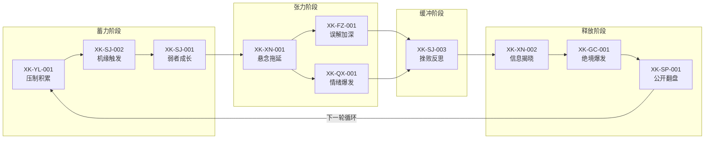
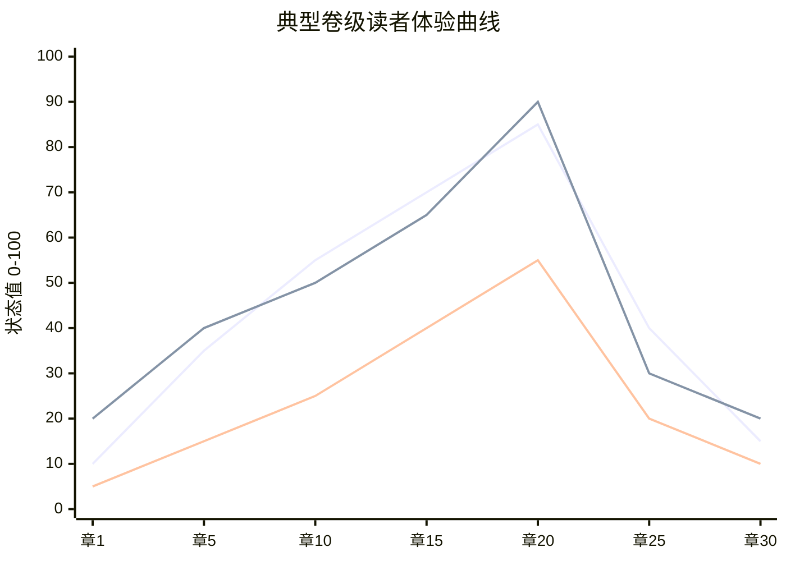
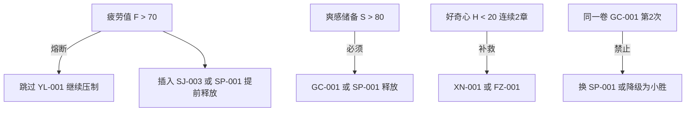

# Xuke v1 全流程经验链示意图

> 启动版 10 条经验原子 + 模式链组合，供 Chuangjie 规划叙事弧时直接调用。

---

## 一、核心叙事循环（总览）



---

## 二、读者状态曲线（示意）



| 阶段 | 主导经验 | S / T / F 趋势 |
|------|----------|----------------|
| 蓄力 | YL-001 → SJ-002 → SJ-001 | S↑ T↑ F缓升 |
| 张力 | XN-001 → FZ-001 / QX-001 | S↑ T↑↑ 好奇↑ |
| 缓冲 | SJ-003 | T↓ F略升 |
| 释放 | XN-002 → GC-001 → SP-001 | S↓↓ T↓↓ F↓↓ |

---

## 三、三条子模式链

### 3.1 压制爆发链（爽感主线）

```
XK-YL-001 压制积累
    → XK-SJ-001 弱者成长
    → XK-GC-001 绝境爆发
    → XK-SP-001 公开翻盘
```

**适用**：打脸、逆袭、卷末高潮

### 3.2 误解崩塌链（悬念主线）

```
XK-XN-001 悬念拖延
    → XK-FZ-001 误解加深
    → XK-XN-002 信息揭晓
    → XK-SP-001 公开翻盘（可选）
```

**适用**：身份反转、阵营误会、情感线

### 3.3 弱势成长链（升级主线）

```
XK-YL-001 压制积累
    → XK-SJ-002 机缘触发
    → XK-SJ-003 挫败反思
    → XK-SJ-001 弱者成长
    → XK-GC-001 绝境爆发
```

**适用**：修炼突破、新地图开篇

---

## 四、Chuangjie 调用示例

### 4.1 查询当前阶段推荐经验

```yaml
操作: 推荐
读者状态:
  期待值: 65
  好奇心: 55
  紧张感: 70
  爽感储备: 75
  疲劳值: 35
上下文:
  叙事阶段: 对峙
  最近触发经验: [XK-YL-001, XK-SJ-001]
```

**预期推荐**：XK-GC-001 或 XK-SP-001（S > 60 且 T > 60）

### 4.2 完章评估上报

```yaml
操作: 评估
章节:
  序号: 12
  叙事摘要: "压制延续，末段触发机缘，成长可见"
  触发经验: [XK-YL-001, XK-SJ-002, XK-SJ-001]
```

### 4.3 模式链整弧规划

```yaml
操作: 查询
类型: 模式链
条件:
  标签: [启动集]
# 返回 XL-001 启动核心循环链，按步骤 1–10 排章
```

---

## 五、经验原子速查表

| 序号 | 经验ID | 名称 | 循环角色 |
|------|--------|------|----------|
| 1 | XK-YL-001 | 压制积累 | 蓄力起点 |
| 2 | XK-SP-001 | 公开翻盘 | 释放终点 |
| 3 | XK-XN-001 | 悬念拖延 | 张力维持 |
| 4 | XK-SJ-001 | 弱者成长 | 能力跃迁 |
| 5 | XK-QX-001 | 情绪爆发 | 情感峰值 |
| 6 | XK-FZ-001 | 误解加深 | 悬念分支 |
| 7 | XK-SJ-002 | 机缘触发 | 转机注入 |
| 8 | XK-XN-002 | 信息揭晓 | 悬念兑现 |
| 9 | XK-SJ-003 | 挫败反思 | 节奏缓冲 |
| 10 | XK-GC-001 | 绝境爆发 | 段级高潮 |

---

## 六、风险熔断点



详细公式见 `04_读者模型/读者状态模型公式.md`。
协议见 `09_接口层/调用协议.md`。
