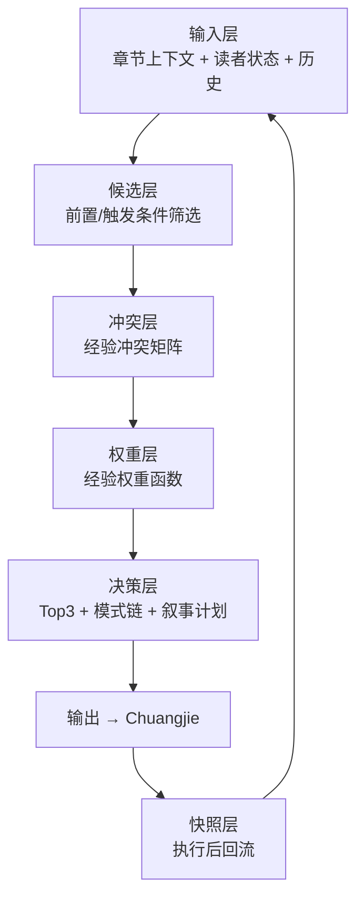

# 推荐引擎 · 决策流程

> Xuke v1.1 决策核心：输入状态 → 输出章节策略（非正文）

---

## 流程图

---

## 逐步算法

### Step 1 · 输入标准化

校验必填字段，映射别名 ID → XK 标准ID。  
规范：`模板/01_输入层.schema.yaml`

### Step 2 · 候选筛选

遍历 `02_经验资产库/` 已发布原子：

1. 检查 `状态 == 已发布`
2. 评估前置条件满足率
3. 评估触发条件满足率
4. 基础匹配分 = 0 则剔除

输出：`候选层.经验原子[]` + 可用模式链。

### Step 3 · 冲突评估

对候选集内每对 `(a, b)`：

- 查 `经验冲突矩阵.yaml` → `原子冲突`
- 对每条候选查 `读者状态冲突`
- 计算 `冲突惩罚分`

输出：`冲突分析` 块。

### Step 4 · 权重计算

对每条候选应用 `经验权重函数.md` 五系数公式。

输出：`权重引擎.计算得分[]`，按 `最终得分` 降序。

### Step 5 · 熔断检查

在 Top 排序前执行熔断 override（见权重函数第九节）。

### Step 6 · 决策输出

组装：

- `主模式链`：模式链得分 Top1
- `支撑原子`：原子得分 Top3（互斥校验通过）
- `叙事计划`：映射到 压制/触发/爆发/收束 四相
- `读者曲线预测`：叠加 Top3 原子的 `读者心理效果`
- `风险警告` + `降级策略`

规范：`模板/05_决策输出层.schema.yaml`

### Step 7 · 快照回流（执行后）

Chuangjie 完章后上报实际结果 → 更新 `历史快照` → 调整历史惩罚系数。

规范：`Snapshot快照层/snapshot.schema.yaml`

---

## 叙事计划四相映射

| 四相 | 典型经验ID |
|------|------------|
| 压制相 | XK-YL-001 |
| 触发相 | XK-SJ-002, XK-FZ-001, XK-XN-001 |
| 爆发相 | XK-GC-001, XK-QX-001, XK-SP-001 |
| 收束相 | XK-XN-002, XK-SJ-003, XK-SJ-001 |

---

## 与接口层关系

| 接口 | 对应步骤 |
|------|----------|
| `09_接口层/决策接口.md` | Step 1–6 完整流水线 |
| `09_接口层/推荐接口.md` | Step 6 简化版（仅 Top 推荐） |
| `09_接口层/评估接口.md` | 执行后 Step 7 前置评估 |
