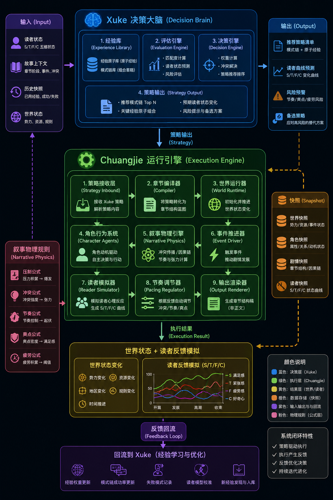

# 双系统工业架构图（Xuke + Chuangjie）

> **主架构图 v2** — 决策脑 + 执行引擎 + 物理规则 + 快照 + 反馈闭环  
> 图片：`双系统工业架构图.png`（源文件：`叙事物理引擎架构图2.png`）

---



---

## 图例（颜色分区）

| 颜色 | 层级 | 归属 |
|------|------|------|
| 紫 | 输入 / 反馈回流 | 双系统边界 I/O |
| 蓝 | 决策大脑 | **Xuke** |
| 粉 | 叙事物理规则 | **Chuangjie** `05_叙事物理引擎` |
| 绿 | 执行引擎 | **Chuangjie** 运行时 |
| 橙 | 快照存储 | **Chuangjie** `09_快照系统` |
| 黄 | 仿真结果 | **Chuangjie** `06_读者模拟器` 输出 |

---

## 一、输入层（图 · 左上紫）

| 图块 | 仓库路径 | 说明 |
|------|----------|------|
| 读者状态 | Xuke `04_读者模型` | 期待值 Q、好奇心 H、紧张感 T、爽感储备 S、疲劳值 F |
| 剧情上下文 | Xuke `10_决策系统/模板/01_输入层` | 章节阶段、事件、冲突、意图 |
| 历史快照 | Xuke `10_决策系统/Snapshot快照层` | 已用经验、失败模式、成功率 |
| 世界状态 | Chuangjie `03_世界运行引擎` | 阵营、资源、规则 |

> 图中 S/T/F/C 读者四维简写 → 仓库对齐 Xuke **五维**（含期待值 Q）。

---

## 二、Xuke 决策大脑（图 · 中上蓝）

| 图模块 | 仓库路径 |
|--------|----------|
| ① 经验库 | `Xuke/02_经验资产库` + `03_模式系统` |
| ② 评估引擎 | `Xuke/05_评估系统` + `04_读者模型` |
| ③ 决策引擎 | `Xuke/10_决策系统`（冲突矩阵 + 权重 + 推荐排序） |
| ④ 策略输出 | `Xuke/09_接口层/决策接口.md` |

规范入口：`Xuke/10_决策系统/v2决策协议.md`

---

## 三、策略输出层（图 · 右上蓝）

| 输出项 | 字段 / 文件 |
|--------|-------------|
| 推荐策略列表 | `决策输出.选定策略` |
| 读者曲线预测 | `决策输出.读者曲线预测` |
| 风险警告 | `决策输出.风险警告` |
| 备用策略 | `决策输出.降级策略` |

示例：`Xuke/10_决策系统/模板/示例/决策运行示例.yaml`

---

## 四、叙事物理规则（图 · 左粉）

| 图公式 | 仓库章节 |
|--------|----------|
| 压制公式 | `Chuangjie/05_叙事物理引擎/叙事物理公式.md` §2.1 §2.6 |
| 冲突公式 | §2.3 |
| 节奏公式 | §2.3b Sigmoid |
| 高潮公式 | §2.1 爆发强度 BI |
| 疲劳公式 | §3 + Xuke 读者模型 |

详图（单引擎）：`Chuangjie/05_叙事物理引擎/叙事物理引擎架构图.png`  
公式化说明：`Chuangjie/05_叙事物理引擎/公式化架构说明.md`

---

## 五、Chuangjie 执行引擎（图 · 中绿 · 九模块）

| 图序号 | 模块 | 仓库路径 |
|--------|------|----------|
| 1 | 策略接收 | `Chuangjie/01_策略接收层` |
| 2 | 章节编译器 | `Chuangjie/02_章节编译器` |
| 3 | 世界运行 | `Chuangjie/03_世界运行引擎` |
| 4 | 角色代理 | `Chuangjie/04_角色行为系统` |
| 5 | 叙事物理 | `Chuangjie/05_叙事物理引擎`（四引擎） |
| 6 | 事件驱动 | `Chuangjie/05_叙事物理引擎/事件驱动器` |
| 7 | 读者模拟 | `Chuangjie/06_读者模拟器` |
| 8 | 节奏调节 | `Chuangjie/07_冲突推进器` |
| 9 | 输出渲染 | `Chuangjie/08_章节输出层` |

快照（图 · 右橙）→ `Chuangjie/09_快照系统`  
反馈（图 · 下紫）→ `Chuangjie/10_反馈回流层` → Xuke

---

## 六、仿真与曲线（图 · 下黄）

| 内容 | 说明 |
|------|------|
| 世界状态变化 | 阵营 / 资源 / 区域 / 规则 / 时间 |
| 读者曲线图 | 开篇→发展→高潮→收束 四阶段 S/T/F/H 走势 |
| 曲线生成 | `06_读者模拟器` + `05_叙事物理公式` |

示例：`Chuangjie/06_读者模拟器/模板/示例/章节推演示例.yaml`

---

## 七、反馈闭环（图 · 下紫）

```text
执行结果 → 回流 Xuke
    ├─ 经验权重更新
    ├─ 模式链成功率
    ├─ 失败模式记录
    └─ 读者模型校准
```

协议：`Chuangjie/11_接口层/回流Xuke快照.md`  
Schema：`Xuke/10_决策系统/Snapshot快照层/snapshot.schema.yaml`

---

## 八、系统闭环四特征（图 · 右下）

| 特征 | 实现 |
|------|------|
| 策略驱动执行 | Xuke 决策 → Chuangjie 01 接收 |
| 执行产生反馈 | 06 模拟 + 09 快照 |
| 反馈优化决策 | 10 回流 → Xuke 历史惩罚 / 学习信号 |
| 持续迭代进化 | Xuke `08_训练进化系统` |

---

## 九、两张架构图关系

| 文件 | 范围 |
|------|------|
| `文档中心/双系统工业架构图.png` | Xuke + Chuangjie 全链路 |
| `Chuangjie/05_叙事物理引擎/叙事物理引擎架构图.png` | 叙事物理公式化（§I–VII） |

入口建议：总览看双系统图；公式推导看叙事物理架构图 + `叙事物理公式.md`。
